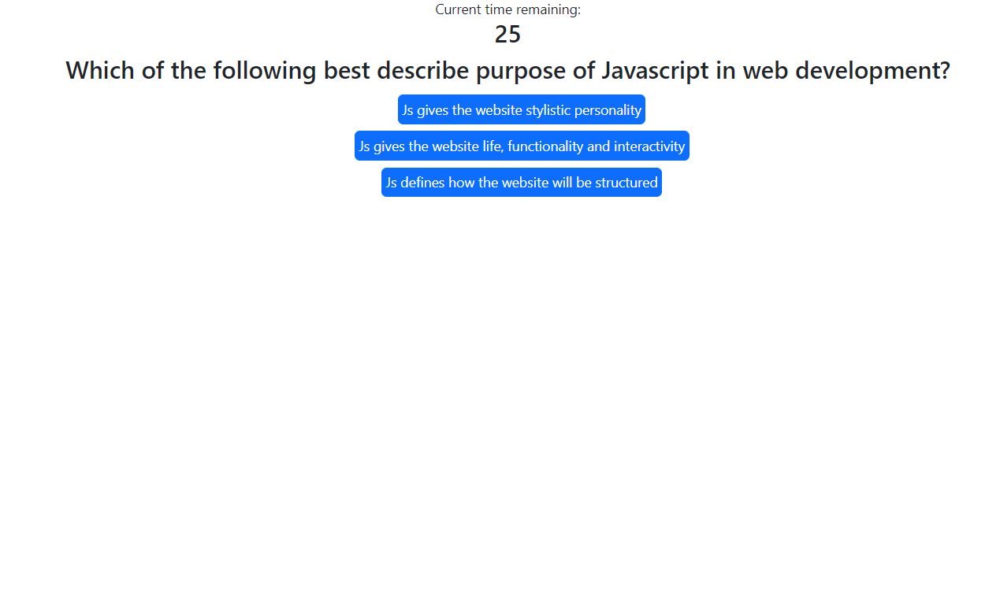

# Challenge 04 - Web API Quiz

This challenge comprised of creating an online quiz which keeps score, removes time for wrong answers, and saves high scores to be accessed another time.

## Image

## Description

When the user visits the page, they are prompted to begin the quiz. Once the quiz has started, a 60 second timer begins. For each question they choose a multiple choice option.They receive feedback on their answer, and then the next question is given. For each correct answer, the user gains 10 score. For each incorrect answer, the user loses 10 seconds of time. At the end of the quiz, they are prompted to enter their initials and then their score will be saved to local storage. If they wish, they can clear all scores from storage.